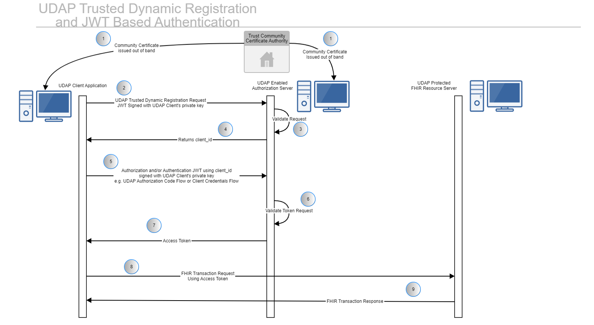
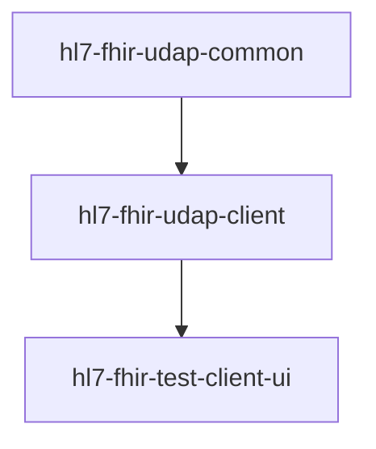
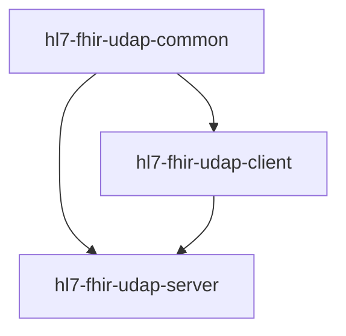

# hl7-fhir-udap-docs

## Overview

[UDAP](https://www.udap.org/) is a trust community protocol built on top of Oauth (Open Authorization) 2.0 and OIDC (OpenID Connect). It combines Public Key Infrastructure (PKI) with Oauth and OIDC to provide the trust community protocol. The specific trust community has a Certificate Authority (CA) or multiple CAs that issue X.509 certificates to all members of the community. These are not the same as SSL certificates that can be obtained by proving ownership of a domain like [Let's Encrypt](https://letsencrypt.org/). The X.509 certificates are issued out of band after proving the identity of the organization obtaining the certificate.

The public and private keys contained in the X.509 certificate are used to provide the signing keys and verifying keys for JSON Web Tokens (JWTs). The X.509 certificates are contained in the header of the JWTs moving the authentication mechanism to the application layer, as opposed to say Mutual TLS (mTLS) where the authentication sits between the application layer and the TCP/IP layer.

## Getting Started
The Prrof of Concept, reference implementation is a four-repository collection for a full [UDAP](https://www.udap.org/) implementation. The implementation adheres to published Version 1.0 of the [HL7 UDAP Security Implementation Guide](http://hl7.org/fhir/us/udap-security/STU1/).

Links to the four repositories in the collection:
- [hl7-fhir-udap-common](https://github.com/Evernorth/hl7-fhir-udap-common#readme)
- [hl7-fhir-udap-client](https://github.com/Evernorth/hl7-fhir-udap-client#readme)
- [hl7-fhir-udap-test-client-ui](https://github.com/Evernorth/hl7-fhir-udap-test-client-ui#readme)
- [hl7-fhir-udap-server](https://github.com/Evernorth/hl7-fhir-udap-server#readme)

At a base level, a full UDAP implementation will include a UDAP enabled client and a UDAP enabled server.   

To build a UDAP enabled client with our collection of repos, you will need:
- [hl7-fhir-udap-common](https://github.com/Evernorth/hl7-fhir-udap-common#readme)
- [hl7-fhir-udap-client](https://github.com/Evernorth/hl7-fhir-udap-client#readme)
- [hl7-fhir-udap-client-ui](https://github.com/Evernorth/hl7-fhir-udap-client-ui#readme)

To build a UDAP enabled server with our collection of repos, you will need:
- [hl7-fhir-udap-common](https://github.com/Evernorth/hl7-fhir-udap-common#readme)
- [hl7-fhir-udap-client](https://github.com/Evernorth/hl7-fhir-udap-client#readme)
- [hl7-fhir-udap-server](https://github.com/Evernorth/hl7-fhir-udap-server#readme)

A good plan to build either a client or server is to follow these steps.

- Start with [UDAP Trusted Dynamic Registartion](https://build.fhir.org/ig/HL7/fhir-udap-security-ig/registration.html)
- Add one of the Authorization and Authentication methods.  Many people start with Busines to Business as it is less complex.
    - [Business to Business](https://build.fhir.org/ig/HL7/fhir-udap-security-ig/b2b.html) (UDAP Client Credentials Flow)
    - [Consumer Facing](https://build.fhir.org/ig/HL7/fhir-udap-security-ig/consumer.html) (UDAP Authorization Code Flow)
    - [Tiered OAuth for User Authentication](https://build.fhir.org/ig/HL7/fhir-udap-security-ig/user.html)

At this point you will have one side (a client or a server) of a full UDAP implementation.   You will need to build the other side to have a full implementation.

## Reference Implementation Overview

***Client Overview***

***Server Overview***

## Getting Help

If you have questions, concerns, bug reports, etc., file an issue in this repository's Issue Tracker.

## Getting Involved

See the [CONTRIBUTING.md](CONTRIBUTING.md) file for info on how to get involved.

## License

The hl7-fhir-udap-test-client is Open Source Software released under the [Apache 2.0 license](https://www.apache.org/licenses/LICENSE-2.0.html).

## Original Contributors

The hl7-fhir-udap-docs was originally developed as a collaborative effort between [Evernorth](https://www.evernorth.com/) and [Okta](https://www.okta.com/). We would like to recognize the following people for their initial contributions to the project: 
 - Tom Loomis, Evernorth
 - Dan Cinnamon, Okta